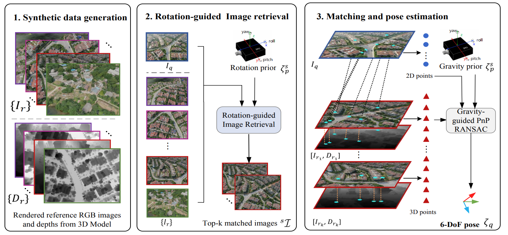

# UAVD4L: A Large-Scale Dataset for UAV 6-DoF Localization

This repository provides the implementation of the "UAVD4L: A Large-Scale Dataset for UAV 6-DoF Localization" as presented in the 3DV 2024 from the National University of Defense Technology.

<p align="center">
  <a href="https://github.com/Choyaa/Targetloc"></a>
</p>
<br/>

## Overview

UAVD4L is a large-scale dataset designed for 6-DoF localization of Unmanned Aerial Vehicles (UAVs) in GPS-denied environments. It includes a textured 3D reference model, query images captured from diverse flight trajectories, and accurate ground truth poses. Additionally, we propose a two-stage 6-DoF localization pipeline (`Targetloc`) that leverages synthetic data generation and online visual localization to achieve precise localization in complex scenes.

## Installation

To set up the `Targetloc` framework, follow these detailed steps:

1. **Create a Conda Environment**:
   Create a new Conda environment named `render2loc` from the provided `environment.yaml` file:
   ```shell
   conda env create -f environment.yaml
   conda activate render2loc
   ```
2. **Install a Rendering Engine**:
Choose and install a suitable rendering engine. You can choose from **Blender**, **OSG (OpenSceneGraph)**, or others, depending on your preference. The texture model could be **OBJ**, **3DTiles**, **OSGB**, or others. We recommend using **3D Tiles** format for the best performance, as its hierarchical loading is better suited for large-scale scenes. We provide a Blender rendering solution in our code.

## Running Tragetloc on your own data
We provide lens parameters for the DJI M300 H20 and DJI Mavic 3T. If you would like to test with other camera models, you can add the camera configuration to the `config` file.

We also provide a **retrieval** interface in the main file if there is no prior pose information.

### Available Pipelines:
1. **Single-frame Localization**:
   To test single-frame localization, run the following script:
   ```shell
   python target_frame.py

2. **Video Stream Localization**: 
    To test video stream localization, run the following script:
    ```shell
    python target_sequence.py


### Notes
- The global coordinate system is the **ECEF (Earth-Centered, Earth-Fixed)** coordinate system. The input supports attitude information in **NED (North-East-Down)** or **ENU (East-North-Up)** coordinate systems, and position information in the **WGS84** coordinate system. These inputs will be uniformly converted to the ECEF coordinate system for localization.


## Citation

For academic use, please cite the following paper:

Wu Rouwan*, Cheng Xiaoya*, Zhu Juelin, Liu Yuxiang, Zhang Maojun and Yan Shen, "UAVD4L: A Large-Scale Dataset for UAV 6-DoF Localization", 3DV 2024.

```bibtex
@inproceedings{wu2024uavd4l,
  title={UAVD4L: A Large-Scale Dataset for UAV 6-DoF Localization},
  author={Wu, Rouwan and Cheng, Xiaoya and Zhu, Juelin and Liu, Yuxiang and Zhang, Maojun and Yan, Shen},
  booktitle={2024 International Conference on 3D Vision (3DV)},
  pages={1574--1583},
  year={2024},
  organization={IEEE}
}
```
